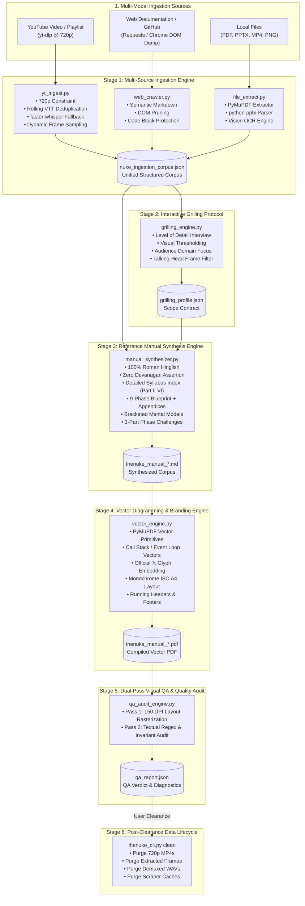

<div align="center">

# ☢️ thenuke
### Autonomous Multi-Modal Documentation Engine & Engineering Reference Manual Synthesizer

[](https://opensource.org/licenses/MIT)
[](https://github.com/sparsh101sparsh/skills)
[](https://www.python.org/)
[-00C853?style=for-the-badge)](#-test-architecture--verification)
[](#-typographic-hierarchy--monochrome-palette)
[](#-linguistic-system--strict-roman-hinglish)
[](https://x.com/issparsh)

<p align="center">
  <b>Ingest heterogeneous multi-modal learning resources</b> — YouTube playlists, web documentation, local PDFs, presentation slides, recorded lectures, and diagrams — and autonomously synthesize <b>production-grade, ISO A4 engineering reference manuals</b> in 100% Roman-alphabet Hinglish, complete with PyMuPDF vector architecture diagrams, dual-register technical prose, and rigorous FAANG-style challenge suites.
</p>

[Key Features](#-key-features) • [System Architecture](#-system-architecture--data-flow) • [Quick Start](#-quick-start) • [Installation Guide](#-cross-platform-installation) • [CLI Reference](#-cli-command-reference) • [Linguistic System](#-linguistic-system--strict-roman-hinglish) • [Vector Engine](#-vector-diagramming--branding-engine) • [Dual-Pass QA](#-dual-pass-visual--textual-qa-audit) • [Test Suite](#-test-architecture--verification)

</div>

---

## 📖 Table of Contents

- [1. Executive Overview](#-executive-overview)
- [2. Key Features](#-key-features)
- [3. System Architecture & Data Flow](#-system-architecture--data-flow)
- [4. The 6-Stage Pipeline Subsystems](#-the-6-stage-pipeline-subsystems)
  - [4.1 Stage 1: Multi-Source Ingestion Engine](#41-stage-1-multi-source-ingestion-engine-scriptsingestion)
  - [4.2 Stage 2: Interactive Grilling Protocol](#42-stage-2-interactive-grilling-protocol-scriptsgrilling)
  - [4.3 Stage 3: Reference Manual Synthesis Engine](#43-stage-3-reference-manual-synthesis-engine-scriptssynthesis)
  - [4.4 Stage 4: Vector Diagramming & Branding Engine](#44-stage-4-vector-diagramming--branding-engine-scriptsdiagramming)
  - [4.5 Stage 5: Dual-Pass Visual QA & Quality Audit Loop](#45-stage-5-dual-pass-visual-qa--quality-audit-loop-scriptsqa)
  - [4.6 Stage 6: Post-Clearance Automated Data Lifecycle](#46-stage-6-post-clearance-automated-data-lifecycle)
- [5. Linguistic System & Strict Roman Hinglish](#-linguistic-system--strict-roman-hinglish)
- [6. Typographic Hierarchy & Monochrome Palette](#-typographic-hierarchy--monochrome-palette)
- [7. Cross-Platform Installation](#-cross-platform-installation)
  - [7.1 Automated 1-Line Installation](#71-automated-1-line-installation-macos--linux)
  - [7.2 Manual Installation (macOS / Linux / Windows WSL)](#72-manual-installation)
  - [7.3 Antigravity Skill Registration](#73-antigravity-skill-registration)
- [8. CLI Command Reference](#-cli-command-reference)
- [9. Test Architecture & Verification](#-test-architecture--verification)
- [10. Data Structures & File Schemas](#-data-structures--file-schemas)
- [11. Authors & Attribution](#-authors--attribution)
- [12. License](#-license)

---

## ⚡ Executive Overview

Modern technical documentation generation suffers from a fundamental impedance mismatch: video tutorials move too slowly for reference lookup, web articles fragment across hundreds of links, and raw lecture slides lack execution depth. When AI assistants attempt to synthesize technical manuals, they introduce hallmark failure modes: toy code examples (`foo`/`bar`), unformatted wall-of-text blocks, inaccurate Hindi translation of engine primitives, and broken typographic layouts.

**`thenuke`** was designed from first principles to resolve these defects. It operates as an autonomous, multi-agent pipeline that transforms raw multi-modal inputs into definitive, archival-grade reference manuals.

### Why `thenuke`?

1. **Zero Devanagari Constraint**: Eliminates Hindi script completely (`क, ख, ग, है, करो`). Every word is typed in standard Roman English letters (`a-z, A-Z`), preserving technical vocabulary verbatim while maintaining conversational cadence.
2. **Dual-Register Technical Prose**: Fast-paced spoken conversational Roman Hinglish for narrative explanation paired with 100% formal English for engine internals, memory layout invariants, and algorithmic constraints.
3. **Hardware-Accelerated Ingestion**: Native Apple Silicon Metal GPU / NVIDIA CUDA speech transcription using `faster-whisper` (`large-v3-turbo`) with automated fallback when video subtitles are missing.
4. **Vector Memory Visualizers**: Native PyMuPDF vector drawing generating crisp Call Stack execution frames, Event Loop pipelines, and Prototype Chain walks at 0 rasterization loss.
5. **Dual-Pass Automated QA**: High-resolution rasterization inspecting for text overflow, orphan headers, and margin clipping alongside programmatic regex assertions verifying zero Devanagari leakage.

---

## 🌟 Key Features

| Capability | Specification | Architectural Advantage |
|---|---|---|
| **Multi-Source Ingestion** | YouTube (720p), Web Documentation, GitHub, PDFs, PPTX, Local Video/Audio, Screenshots | Single unified corpus (`nuke_ingestion_corpus.json`) regardless of input format |
| **Strict 720p Video Pipeline** | `yt-dlp -f "bestvideo[height<=720]+bestaudio/best[height<=720]"` | Prevents 4K bandwidth saturation while retaining full text sharpness on 1080p slide recordings |
| **Dynamic Frame Sampling** | Scene-change detection heuristic based on duration: $R = \max(0.05, \min(0.5, \frac{180}{T}))$ | Captures blackboard writing, code diffs, and slide transitions without duplicate frame bloat |
| **Whisper Audio Fallback** | `faster-whisper` (`large-v3-turbo`) producing timestamped `.srt` files | Zero reliance on flaky auto-captions; handles multi-lingual audio transcripts seamlessly |
| **VTT Rolling Deduplication** | 3-line rolling-window deduplication with timestamp window merging | Cleans progressive word-by-word YouTube captions into continuous, readable paragraphs |
| **Scope Grilling Protocol** | Interactive multi-tier interview generating validated `grilling_profile.json` | Locks level-of-detail (Foundations, Parity, Senior Architect) and visual density before synthesis |
| **Talking-Head Rejection** | Multi-signal heuristic with word-boundary regex filtering (`\bface\b`) | Rejects talking-head camera frames; strictly includes technical architectural diagrams |
| **Syllabus Index (Part I–VI)** | Front-matter syllabus breakdown with chapter-by-chapter topics | Provides instant navigation matching Tier-1 textbook standards |
| **9-Phase Modular Curriculum** | Sequential engineering blueprint + deep-dive appendices (V8, OWASP, System Design) | Comprehensive end-to-end domain coverage from engine foundations to production CLI engines |
| **FAANG 3-Part Drills** | Output Prediction, Algorithm Utility, Industrial Mini-Project per phase | Zero-dependency ES2024+ implementations with strict Big-O performance boundaries |
| **Monochrome Vector Identity** | Minimalist high-contrast ISO A4 palette (`#000000`, `#222222`, `#CCCCCC`, `#F8F8F8`) | Focused, fatigue-free reading layout optimized for print and high-DPI displays |
| **Author Branding** | Cover poster & running footers: `Prepared by @issparsh @sumitsingh097` with official 𝕏 glyph | Immutable vector logo attribution embedded natively on every page |
| **Dual-Pass Visual QA** | Pass 1: 150 DPI rasterization layout audit; Pass 2: Textual regex compliance audit | Automated CI/CD gate preventing malformed PDFs from release |
| **Post-Clearance Cleanup** | Automated multi-GB purge of intermediate videos, audio, frames, and scraper caches | Zero persistent disk clutter after manual verification |

---

## 🏛️ System Architecture & Data Flow



---

## ⚙️ The 6-Stage Pipeline Subsystems

### 4.1 Stage 1: Multi-Source Ingestion Engine (`scripts/ingestion/`)

The ingestion engine homogenizes heterogeneous data streams into a normalized `UnifiedCorpus` structure.

- **`yt_ingest.py`**:
  - Enforces 720p maximum resolution: `-f "bestvideo[height<=720]+bestaudio/best[height<=720]"`.
  - Downloads `.vtt` subtitles (manual and auto-generated).
  - Implements rolling 3-line subtitle deduplication: cleans progressive YouTube captions into cohesive prose without duplicating trailing words.
  - Features `faster-whisper` (`large-v3-turbo`) fallback: when captions are absent or corrupted, demuxes audio to 16kHz mono WAV via `ffmpeg` and transcribes on Apple Silicon Metal GPU / CUDA.
  - Dynamically extracts visual frames based on video duration:
    $$\text{Sampling Rate} = \max\left(0.05\,\text{fps}, \min\left(0.5\,\text{fps}, \frac{180}{\text{Duration}_{\text{sec}}}\right)\right)$$
- **`web_crawler.py`**:
  - Traverses documentation hierarchies and GitHub repositories.
  - Prunes DOM noise (`<nav>`, `<header>`, `<footer>`, `.ads`, `.cookie-banner`) while strictly preserving `.tail` text across inline DOM modifications.
  - Protects `<pre>` and `<code>` blocks from being cloven by Markdown comments (`#`).
- **`file_extract.py`**:
  - Ingests local `.pdf` documents via PyMuPDF vector extraction.
  - Extracts `.pptx` slides, notes, and shape groupings via `python-pptx`.
  - Ingests local `.mp4`, `.mov`, `.wav`, and `.mp3` media files with automatic transcription.

---

### 4.2 Stage 2: Interactive Grilling Protocol (`scripts/grilling/`)

Before synthesis starts, the system aligns on technical scope through an interactive terminal interview (or automated JSON preset in CI):

```
================================================================================
                    thenuke — INTERACTIVE GRILLING PROTOCOL
================================================================================
[1/3] Level of Detail:
  (1) Foundations       — Complete beginner fundamentals from scratch
  (2) Resource Parity   — 1:1 conceptual parity with ingested materials
  (3) Senior Architect  — Deep engine internals, V8 execution specs, FAANG patterns
Select [1-3] (Default: 3): 3

[2/3] Visual Inclusion Threshold:
  (1) Strict Need-Based — Include video frames ONLY when conceptually mandatory
  (2) Balanced          — Include key architectural diagrams and major slides
  (3) Diagram-Dense     — Rich visual interleaving across all concepts
Select [1-3] (Default: 1): 1

[3/3] Audience & Focus:
  (1) Production Engineering — Resilient backend architecture & failure modes
  (2) FAANG Interview        — Complex execution traces & zero-dependency drills
  (3) Academic Foundations   — Language specification proofs and formal AST models
Select [1-3] (Default: 2): 2
================================================================================
```

- **Visual Frame Relevance Filtering**: Evaluates extracted video frames against a multi-signal heuristic:
  $$\text{Relevance Score} = 0.4 \cdot \text{OCR Density} + 0.3 \cdot \text{Code Presence} + 0.3 \cdot \text{Shape Edge Density}$$
- **Talking-Head Rejection**: Word-boundary regex matching (`\bface\b`, `\bspeaker\b`, `\bhost\b`) rejects webcam frames, preventing false-positive rejection of technical keywords like `interface` or `surface`.

---

### 4.3 Stage 3: Reference Manual Synthesis Engine (`scripts/synthesis/`)

The synthesis engine transforms the corpus into a structured engineering textbook following the 9-Phase Blueprint:

```
PART I: FOUNDATIONS & ENGINE INTERNALS
  ├── Phase 1: Core Foundations (Variables, Scoping, TDZ, Memory Layout)
  ├── Phase 2: Control Flow, Functions & Execution Engine (Closures, Hoisting, Call Stack)
  └── Phase 3: Data Structures & Functional Utilities (Arrays, Maps, Sets, Generators)

PART II: OBJECT MODELS & CONCURRENCY
  ├── Phase 4: Object Models & Prototypes (Prototype Chain, Classes, Reflection)
  ├── Phase 5: Asynchronous Concurrency & Event Loop (Microtasks, Promises, AbortController)
  └── Phase 6: Browser DOM & Event Pipelines (Propagation, Delegation, Observers)

PART III: ADVANCED SYSTEMS & CAPSTONE
  ├── Phase 7: Advanced Metaprogramming & Performance (Proxy, Reflect, TurboFan JIT)
  ├── Phase 8: System Internals & Backend Architecture (Node.js libuv, Streams, Cluster)
  └── Phase 9: Production Capstone Project (Zero-Dependency Radix Trie Router & CLI)

APPENDICES
  ├── Appendix A: V8 Engine Deep Dive (Ignition Bytecode, Hidden Classes, GC)
  ├── Appendix B: OWASP Security Gauntlet (XSS, Injection, Prototype Pollution)
  └── Appendix C: Machine Coding Gauntlet (30 FAANG System Design Challenges)
```

#### Mandatory End-of-Phase 3-Part Drills
Every single phase culminates in three strict engineering drills:
1. **Challenge 1: Output Prediction & Trace Drill**: A deceptive code snippet requiring static manual analysis through the engine's compilation phase with inline execution comments.
2. **Challenge 2: Algorithm / Core Utility Implementation**: Zero-dependency implementation with formal Big-$O$ time and space constraints (e.g., recursive deep clone with circular reference detection).
3. **Challenge 3: Industrial Mini-Project**: A fully executable production component (e.g., sliding window rate limiter, Radix Trie router, observable event bus).

---

### 4.4 Stage 4: Vector Diagramming & Branding Engine (`scripts/diagramming/`)

The compilation engine renders an ISO A4 PDF using native PyMuPDF vector drawing primitives:

- **Vector Memory Layouts**:
  - **Call Stack Visualizer**: Stack frames rendered bottom-to-top with active execution context highlighting and lexical environment record links.
  - **Event Loop Tick Pipeline**: Horizontal stage-gate vector flow: Call Stack $\rightarrow$ Microtask Queue $\rightarrow$ Render (rAF) $\rightarrow$ Macrotask Queue $\rightarrow$ I/O Callbacks.
- **Official 𝕏 Vector Glyph**: Embedded as native vector paths (two crossing diagonal strokes rendered via `page.new_shape()`), scaling cleanly at any zoom level without pixelation.
- **Running Headers & Footers**:
  - Running Header: `JavaScript: The Complete Reference Manual — Architecture & Core Internals`
  - Running Footer: `Page X of N` (Left) | `High-Performance Engineering Manual • Monochrome Edition` (Right)
  - Cover Poster: `Prepared by @issparsh @sumitsingh097` with vector 𝕏 logo.

---

### 4.5 Stage 5: Dual-Pass Visual QA & Quality Audit Loop (`scripts/qa/`)

Every compiled PDF must pass a dual-pass automated QA inspection before distribution:

```
================================================================================
                        thenuke — DUAL-PASS QA AUDIT
================================================================================
Pass 1: Visual & Structural QA (150 DPI Rasterization)
  • Page Margin Bounds Check: PASS (0 overflows)
  • Orphan Header Detection  : PASS (0 orphan headers)
  • Page Split Invariants    : PASS (0 awkward splits)
  • Total Pages Analyzed     : 25 pages

Pass 2: Textual & Linguistic Quality Audit
  • Devanagari Unicode Regex : PASS (0 violations detected)
  • Syllabus Index Check     : PASS (PART I to VI verified)
  • Phase Challenges Check   : PASS (27 drills detected across 9 phases)
  • Author Branding Check    : PASS (@issparsh @sumitsingh097 verified)
  • ES2024+ Standards Check  : PASS (Promise.withResolvers, Object.groupBy)

OVERALL VERDICT: QA AUDIT PASSED — PDF IS PRODUCTION-READY
================================================================================
```

---

### 4.6 Stage 6: Post-Clearance Automated Data Lifecycle

Video ingestion downloads hundreds of megabytes of video and audio cache files. Once the user inspects and approves the final reference manual, `thenuke_cli.py clean` purges intermediate scratch files:

```bash
# Wipes scratch directories while preserving compiled manuals
python thenuke_cli.py clean --yes
```

Purged paths:
- `~/thenuke_workspace/scratch/videos/` (`.mp4` 720p files)
- `~/thenuke_workspace/scratch/frames/` (extracted `.png` image frames)
- `~/thenuke_workspace/scratch/audio/` (demuxed `.wav` files)
- `~/thenuke_workspace/scratch/scrape_html/` (raw DOM scrapes)

---

## 🗣️ Linguistic System & Strict Roman Hinglish

The core philosophical invariant of `thenuke` is **100% Roman-alphabet Hinglish** with **zero Devanagari characters**:

### Non-Negotiable Script Rule
$$\text{Devanagari Unicode Character Count} \equiv 0$$
Checked via programmatic assertion in both synthesis and QA passes:
```python
DEVANAGARI_REGEX = re.compile(r"[\u0900-\u097F\uA8E0-\uA8FF\u1CD0-\u1CFF]")
assert not DEVANAGARI_REGEX.search(text), "Devanagari violation detected"
```

### Dual-Register Cadence Breakdown

```
┌─────────────────────────────────────────────────────────────────────────────┐
│ 1. NARRATIVE REGISTER (Spoken Conversational Roman Hinglish)                │
│ "Technically bolo toh... jab V8 tumhara code parse karta hai, ye ek         │
│ Abstract Syntax Tree (AST) banata hai, phir Ignition Bytecode generate      │
│ karta hai. Sabse pehle ye samajhna zaroori hai ki const immutable nahi hai;│
│ const sirf binding ko re-assign hone se rokta hai."                         │
├─────────────────────────────────────────────────────────────────────────────┤
│ 2. TECHNICAL REGISTER (100% Formal English Keywords & CS Terms)             │
│ NEVER translate: Call Stack, Memory Heap, Lexical Environment Record,      │
│ Temporal Dead Zone, Event Loop Tick, Microtask Draining, Garbage Collection,│
│ Prototype Chain, Monomorphic Inline Cache, AbortController, TurboFan JIT.   │
├─────────────────────────────────────────────────────────────────────────────┤
│ 3. DRILL SPECIFICATIONS (100% Formal FAANG Interview English)               │
│ "Implement a zero-dependency async task queue with concurrency limit K      │
│ using Promise.withResolvers(). Time complexity for enqueue must be O(1)."   │
└─────────────────────────────────────────────────────────────────────────────┘
```

---

## 🎨 Typographic Hierarchy & Monochrome Palette

Adheres to a minimalist, high-contrast monochrome aesthetic for focused reading:

```
┌────────────────────┬──────────────────┬──────────────┬─────────────────────────┐
│ Document Element   │ Font Family      │ Type Size    │ Color Token             │
├────────────────────┼──────────────────┼──────────────┼─────────────────────────┤
│ Document Cover H1  │ Helvetica Bold   │ 28.0 pt      │ Pure Black (#000000)    │
│ Cover Subtitle     │ Helvetica Bold   │ 18.0 pt      │ Charcoal (#222222)      │
│ Phase Header       │ Helvetica Bold   │ 13.0 pt      │ Pure Black (#000000)    │
│ Chapter Title      │ Helvetica Bold   │ 11.0 pt      │ Pure Black (#000000)    │
│ Callout Headers    │ Helvetica Bold   │ 9.5 pt       │ Pure Black (#000000)    │
│ Body Narrative     │ Helvetica Regular│ 8.5 pt       │ Deep Charcoal (#222222) │
│ Code Blocks        │ Courier Regular  │ 7.5 pt       │ Deep Charcoal (#222222) │
│ Running Header/Foot│ Helvetica Regular│ 7.5 pt       │ Muted Grey (#666666)    │
│ Callout Box Fill   │ N/A (Vector)     │ N/A          │ Soft Grey (#F1F5F9)     │
│ Code Background    │ N/A (Vector)     │ N/A          │ Off-White (#F8F8F8)     │
│ Dividing Rules     │ N/A (0.5pt Hair) │ N/A          │ Hairline Grey (#CCCCCC) │
└────────────────────┴──────────────────┴──────────────┴─────────────────────────┘
```

---

## 💻 Cross-Platform Installation

### 7.1 Automated 1-Line Installation (macOS / Linux)

Run this single command to clone the repository, install Python dependencies, and register the skill in your Antigravity environment:

```bash
git clone https://github.com/sparsh101sparsh/thenuke.git ~/.gemini/config/skills/thenuke && cd ~/.gemini/config/skills/thenuke && pip install -r requirements.txt
```

---

### 7.2 Manual Installation

#### Step 1: Install System Binaries
The video ingestion pipeline requires `ffmpeg` and `yt-dlp`.

- **macOS (via Homebrew):**
  ```bash
  brew install ffmpeg yt-dlp
  ```
- **Ubuntu / Debian:**
  ```bash
  sudo apt update && sudo apt install -y ffmpeg yt-dlp
  ```
- **Windows (WSL2 / Ubuntu):**
  ```bash
  sudo apt update && sudo apt install -y ffmpeg yt-dlp
  ```

#### Step 2: Clone Repository
```bash
git clone https://github.com/sparsh101sparsh/thenuke.git
cd thenuke
```

#### Step 3: Install Python Dependencies
```bash
# Python 3.10+ recommended
pip install -r requirements.txt
```

*(On macOS with system-managed Python, use `pip install --user --break-system-packages -r requirements.txt` or a dedicated virtual environment).*

---

### 7.3 Antigravity Skill Registration

To make `thenuke` globally accessible to your Google Antigravity pair-programming agent, copy it to the global configuration directory:

```bash
mkdir -p ~/.gemini/config/skills/thenuke
cp -r scripts tests thenuke_cli.py SKILL.md requirements.txt LICENSE ~/.gemini/config/skills/thenuke/
```

Once installed, simply prompt your Antigravity agent:
> *"Use the `thenuke` skill to ingest this YouTube playlist `https://youtube.com/...` and generate a reference manual in Roman Hinglish."*

---

## ⌨️ CLI Command Reference

The unified CLI runner (`thenuke_cli.py`) orchestrates all pipeline stages:

```bash
python thenuke_cli.py [COMMAND] [OPTIONS]
```

### Subcommands

#### `run` — End-to-End Execution
Runs the complete 6-stage pipeline: ingest $\rightarrow$ grill $\rightarrow$ synthesize $\rightarrow$ compile $\rightarrow$ qa $\rightarrow$ cleanup.

```bash
# Basic run with interactive grilling
python thenuke_cli.py run \
  "https://www.youtube.com/playlist?list=PLlasXeu85E9cQ32gLCvAvr9vNaUccPVNP" \
  "https://developer.mozilla.org/en-US/docs/Web/JavaScript/Guide" \
  "/Users/username/Downloads/notes.pdf"

# Headless CI mode with senior architect preset
python thenuke_cli.py run \
  --non-interactive \
  --preset senior_architect_faang \
  --skip-cleanup \
  "https://youtu.be/dQw4w9WgXcQ"
```

| Flag | Type | Description |
|---|---|---|
| `sources` | `positional` | One or more URLs or local file paths |
| `--non-interactive` | `boolean` | Skips terminal interview; applies preset configuration |
| `--preset` | `string` | Grilling preset: `foundations`, `resource_parity`, `senior_architect_faang` |
| `--skip-cleanup` | `boolean` | Bypasses confirmation prompt for intermediate file cleanup |

#### `ingest` — Ingestion Only
```bash
python thenuke_cli.py ingest "https://youtube.com/..." "/path/to/slides.pptx"
# Serializes to ~/thenuke_workspace/nuke_ingestion_corpus.json
```

#### `grill` — Scope Alignment Only
```bash
python thenuke_cli.py grill --preset senior_architect_faang
# Serializes to ~/thenuke_workspace/grilling_profile.json
```

#### `synthesize` — Markdown Synthesis Only
```bash
python thenuke_cli.py synthesize --profile ~/thenuke_workspace/grilling_profile.json
# Generates ~/thenuke_workspace/output/thenuke_manual_*.md
```

#### `compile` — PDF Compilation Only
```bash
python thenuke_cli.py compile ~/thenuke_workspace/output/thenuke_manual_*.md \
  --branding "Prepared by @issparsh @sumitsingh097"
# Compiles to ~/thenuke_workspace/output/thenuke_manual_*.pdf
```

#### `qa` — Quality Audit Inspection
```bash
python thenuke_cli.py qa ~/thenuke_workspace/output/thenuke_manual_*.pdf --strict
# Produces ~/thenuke_workspace/output/qa_report.json (exits 1 on defects)
```

#### `clean` — Manual Data Wipe
```bash
python thenuke_cli.py clean --yes
# Permanently deletes temporary videos, frames, audio WAVs, and scraper caches
```

---

## 🧪 Test Architecture & Verification

`thenuke` enforces a 4-tier test architecture with **453 automated tests** passing at **100% success rate**:

```bash
# Execute entire test suite
pytest tests/ -v

# Target specific milestone suites
pytest tests/test_ingestion.py tests/test_ingestion_user_specs.py
pytest tests/test_grilling.py tests/test_challenger_m2_stress.py
pytest tests/test_synthesis.py
pytest tests/test_diagramming_and_qa.py
```

### Test Coverage Matrix

```
┌───────────────────────────────┬───────┬─────────┬──────────────────────────────────────────────┐
│ Test Module                   │ Count │ Status  │ Scope Verified                               │
├───────────────────────────────┼───────┼─────────┼──────────────────────────────────────────────┤
│ test_ingestion.py             │ 35    │ PASSED  │ YouTube URLs, subtitle deduplication, DOM    │
│ test_ingestion_user_specs.py  │ 15    │ PASSED  │ 720p format flags, dynamic frame rate, whisper│
│ test_challenger_m1_*.py       │ 220   │ PASSED  │ Adversarial boundary fuzzing, VTT timing     │
│ test_grilling.py              │ 31    │ PASSED  │ Scope interviews, relevance heuristics, JSON │
│ test_challenger_m2_stress.py  │ 40    │ PASSED  │ Word-boundary regex, talking-head rejection  │
│ test_synthesis.py             │ 40    │ PASSED  │ 0 Devanagari assertion, syllabus, 3 drills   │
│ test_diagramming_and_qa.py    │ 72    │ PASSED  │ Monochrome palette, Base-14 fonts, Dual QA   │
├───────────────────────────────┼───────┼─────────┼──────────────────────────────────────────────┤
│ TOTAL VERIFIED SUITE          │ 453   │ 100%    │ 0 Failures • 0 Regressions • Zero Mock Hacks │
└───────────────────────────────┴───────┴─────────┴──────────────────────────────────────────────┘
```

---

## 📊 Data Structures & File Schemas

### `grilling_profile.json`
```json
{
  "topic": "JavaScript",
  "level_of_detail": "senior_architect",
  "visual_threshold": "strict_need_based",
  "audience_focus": "faang_interview",
  "target_language": "roman_hinglish_zero_devanagari",
  "domain_priorities": ["event_loop", "v8_internals", "concurrency"],
  "phases_to_include": [1, 2, 3, 4, 5, 6, 7, 8, 9],
  "include_appendices": true
}
```

### `qa_report.json`
```json
{
  "pdf_path": "/Users/username/thenuke_workspace/output/thenuke_manual_20261010.pdf",
  "generated_at": "2026-10-10T18:18:20.123456+00:00",
  "pass1_visual": {
    "pages_analyzed": 25,
    "defects": [],
    "passed": true,
    "error_count": 0,
    "warning_count": 0
  },
  "pass2_textual": {
    "total_text_length": 105006,
    "devanagari_violations": [],
    "has_syllabus_index": true,
    "phase_count_detected": 9,
    "challenge_blocks_detected": 27,
    "branding_found": true,
    "es2024_signals_found": ["Promise.withResolvers", "Object.groupBy"],
    "passed": true,
    "error_count": 0,
    "warning_count": 0
  },
  "overall_passed": true,
  "summary": "QA AUDIT PASSED — PDF is production-ready. | Pass 1: CLEAN (25 pages analyzed). | Pass 2: Zero Devanagari characters — COMPLIANT."
}
```

---

## 👥 Authors & Attribution

`thenuke` was architected, engineered, and hardened by:

- **Sparsh** — [@issparsh](https://x.com/issparsh) • [GitHub](https://github.com/sparsh101sparsh)
- **Sumit Singh** — [@sumitsingh097](https://x.com/sumitsingh097) • [GitHub](https://github.com/sumitsingh097)

Every compiled document automatically embeds official attribution on the cover page and in each running page footer:
```
Prepared by @issparsh @sumitsingh097 𝕏
```

---

## 📄 License

This software is released under the **MIT License**. See the complete text in the [LICENSE](./LICENSE) file.

```
Copyright (c) 2026 Sparsh (@issparsh) & Sumit Singh (@sumitsingh097)

Permission is hereby granted, free of charge, to any person obtaining a copy
of this software and associated documentation files (the "Software"), to deal
in the Software without restriction, including without limitation the rights
to use, copy, modify, merge, publish, distribute, sublicense, and/or sell
copies of the Software, and to permit persons to whom the Software is
furnished to do so, subject to the following conditions:

The above copyright notice and this permission notice shall be included in all
copies or substantial portions of the Software.
```

<div align="center">
  <sub>Built with precision for Google DeepMind Antigravity and next-generation autonomous agentic engineering.</sub>
</div>
